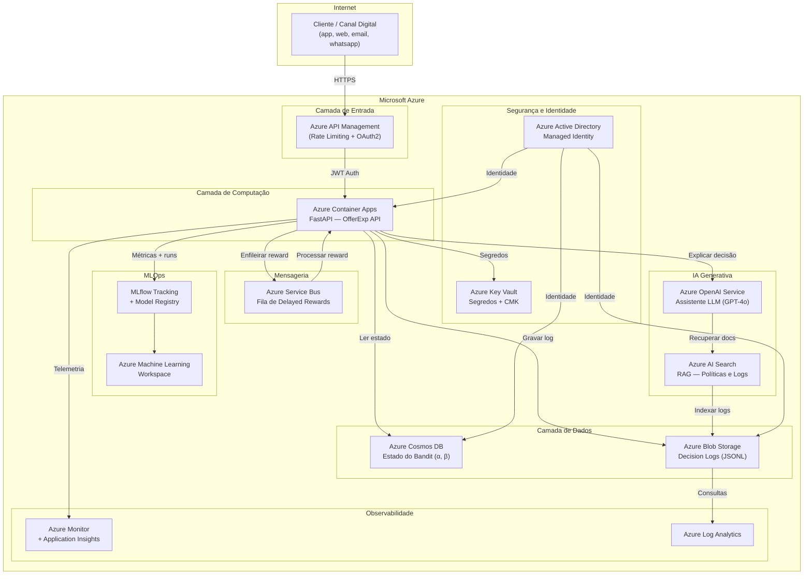

# Arquitetura Azure — OfferExp

**Projeto**: Datathon 7MLET — Plataforma de Experimentação Adaptativa  
**Grupo**: 77 — Geremias Francisco / Wagner Ulisses  
**Data**: Junho 2025

---

## Visão Geral

A plataforma OfferExp é projetada para rodar na **Microsoft Azure**, aproveitando serviços gerenciados para garantir escalabilidade, observabilidade e governança.

### Diagrama de Arquitetura (Mermaid)



---

## Serviços Azure Utilizados

### Computação

| Serviço | Uso | Justificativa |
|---------|-----|---------------|
| **Azure Container Apps** | API FastAPI | Escalabilidade automática, sem gerenciamento de servidor |
| **Azure Container Registry** | Imagens Docker | Repositório privado de containers |

### Dados e Armazenamento

| Serviço | Uso | Justificativa |
|---------|-----|---------------|
| **Azure Blob Storage** | Decision Logs (JSONL) | Armazenamento imutável, baixo custo, auditável |
| **Azure Cosmos DB** | Estado do bandit (α, β por braço) | Latência baixa, consistência configurável |

### Mensageria

| Serviço | Uso | Justificativa |
|---------|-----|---------------|
| **Azure Service Bus** | Fila de rewards assíncronos | Desacopla recebimento de recompensas atrasadas da decisão |

### MLOps

| Serviço | Uso | Justificativa |
|---------|-----|---------------|
| **Azure Machine Learning** | Workspace MLflow | Tracking de experimentos, model registry |
| **MLflow** | Logging de métricas e artefatos | Padrão open-source integrado ao Azure ML |

### IA Generativa

| Serviço | Uso | Justificativa |
|---------|-----|---------------|
| **Azure OpenAI Service** | Assistente de explicabilidade | GPT-4 para explicar decisões em linguagem natural |
| **Azure AI Search** | RAG sobre logs e políticas | Recuperação semântica de decisões históricas |

### Observabilidade

| Serviço | Uso | Justificativa |
|---------|-----|---------------|
| **Azure Monitor** | Métricas de infraestrutura | CPU, memória, rede |
| **Application Insights** | Métricas de aplicação | Latência, throughput, erros de API |
| **Azure Log Analytics** | Consultas sobre logs | Análise de decisões e conversões |

### Segurança e Governança

| Serviço | Uso | Justificativa |
|---------|-----|---------------|
| **Azure Active Directory** | Autenticação | OAuth2 / Managed Identity |
| **Azure Key Vault** | Segredos e chaves CMK | Rotação automática, acesso auditado |
| **Azure Policy** | Conformidade | Aplicação de regras LGPD/segurança |

---

## Pipeline de Dados

```
Kaggle Dataset
     │
     ▼
Azure Blob Storage (raw)
     │
     ▼
Azure ML Pipeline
  ├── Limpeza e tradução de colunas
  ├── Remoção de data leakage (duracao_contato)
  └── Geração de enriquecimento sintético
     │
     ▼
Azure Blob Storage (processed / synthetic_enrichment)
     │
     ▼
Azure ML - MLflow Experiments
  ├── Baseline (Random, Greedy)
  └── Thompson Sampling
     │
     ▼
Azure Container Apps (Decision API)
     │
     ├─▶ POST /decide → Cosmos DB (state) + Blob (log)
     └─▶ POST /reward → Service Bus → Update Cosmos DB
```

---

## Fluxo de Decisão em Tempo Real

```
Aplicação do cliente
        │
        ▼
Azure API Management (rate limiting, auth)
        │
        ▼
Azure Container Apps — FastAPI
        │
   ┌────┴─────┐
   │          │
   ▼          ▼
Cosmos DB   Blob Storage
(ler α,β)   (gravar log)
   │
   ▼
Thompson Sampling → seleciona braço
        │
        ▼
Resposta ao cliente (arm_id, arm_name, reason_codes)
        │
        ▼ (assíncrono, após interação)
Service Bus → Worker → Cosmos DB (atualizar α,β)
                     → MLflow (log métricas)
```

---

## Estimativa de Custo (ambiente de desenvolvimento)

| Serviço | SKU | Custo estimado/mês |
|---------|-----|-------------------|
| Container Apps | 0.5 vCPU / 1 GB | ~$15 |
| Cosmos DB | Serverless | ~$5 |
| Blob Storage | LRS, 10 GB | ~$1 |
| Service Bus | Standard, 1M msg | ~$10 |
| Azure ML (MLflow) | Compute básico | ~$30 |
| Azure OpenAI | GPT-4o mini, 1M tokens | ~$15 |
| **Total estimado** | | **~$76/mês** |

---

## Considerações de Segurança

- Toda comunicação interna via **HTTPS/TLS 1.3**.
- API Management com autenticação **OAuth2 + JWT**.
- Cosmos DB e Blob acessados via **Managed Identity** (sem credenciais hardcoded).
- Segredos no **Azure Key Vault** com rotação automática.
- Logs de auditoria retidos por 5 anos em Blob imutável (WORM policy).
