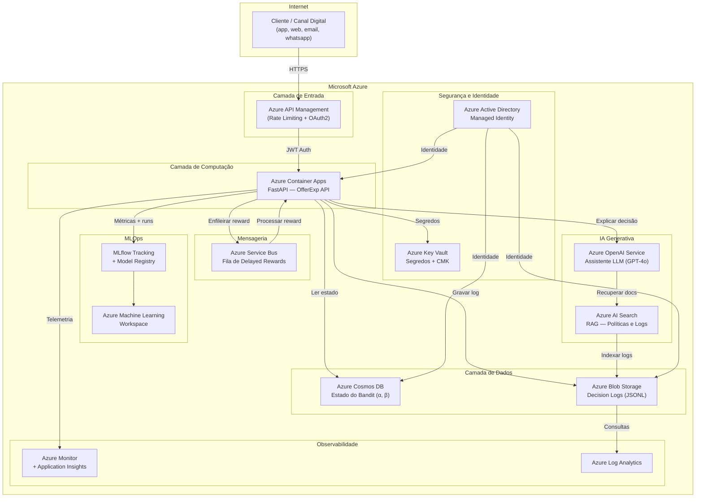

# Arquitetura Azure — OfferExp

**Projeto**: Datathon 7MLET — Plataforma de Experimentação Adaptativa  
**Grupo**: 77 — Geremias Francisco / Wagner Ulisses  
**Data**: Junho 2025

---

## Visão Geral

A plataforma OfferExp é projetada para rodar na **Microsoft Azure**, aproveitando serviços gerenciados para garantir escalabilidade, observabilidade e governança.

### Diagrama de Arquitetura (Mermaid)



---

## Serviços Azure Utilizados

### Computação

| Serviço | Uso | Justificativa |
|---------|-----|---------------|
| **Azure Container Apps** | API FastAPI | Escalabilidade automática, sem gerenciamento de servidor |
| **Azure Container Registry** | Imagens Docker | Repositório privado de containers |

### Dados e Armazenamento

| Serviço | Uso | Justificativa |
|---------|-----|---------------|
| **Azure Blob Storage** | Decision Logs (JSONL) | Armazenamento imutável, baixo custo, auditável |
| **Azure Cosmos DB** | Estado do bandit (α, β por braço) | Latência baixa, consistência configurável |

### Mensageria

| Serviço | Uso | Justificativa |
|---------|-----|---------------|
| **Azure Service Bus** | Fila de rewards assíncronos | Desacopla recebimento de recompensas atrasadas da decisão |

### MLOps

| Serviço | Uso | Justificativa |
|---------|-----|---------------|
| **Azure Machine Learning** | Workspace MLflow | Tracking de experimentos, model registry |
| **MLflow** | Logging de métricas e artefatos | Padrão open-source integrado ao Azure ML |

### IA Generativa

| Serviço | Uso | Justificativa |
|---------|-----|---------------|
| **Azure OpenAI Service** | Assistente de explicabilidade | GPT-4 para explicar decisões em linguagem natural |
| **Azure AI Search** | RAG sobre logs e políticas | Recuperação semântica de decisões históricas |

### Observabilidade

| Serviço | Uso | Justificativa |
|---------|-----|---------------|
| **Azure Monitor** | Métricas de infraestrutura | CPU, memória, rede |
| **Application Insights** | Métricas de aplicação | Latência, throughput, erros de API |
| **Azure Log Analytics** | Consultas sobre logs | Análise de decisões e conversões |

### Segurança e Governança

| Serviço | Uso | Justificativa |
|---------|-----|---------------|
| **Azure Active Directory** | Autenticação | OAuth2 / Managed Identity |
| **Azure Key Vault** | Segredos e chaves CMK | Rotação automática, acesso auditado |
| **Azure Policy** | Conformidade | Aplicação de regras LGPD/segurança |

---

## Pipeline de Dados

```
Kaggle Dataset
     │
     ▼
Azure Blob Storage (raw)
     │
     ▼
Azure ML Pipeline
  ├── Limpeza e tradução de colunas
  ├── Remoção de data leakage (duracao_contato)
  └── Geração de enriquecimento sintético
     │
     ▼
Azure Blob Storage (processed / synthetic_enrichment)
     │
     ▼
Azure ML - MLflow Experiments
  ├── Baseline (Random, Greedy)
  └── Thompson Sampling
     │
     ▼
Azure Container Apps (Decision API)
     │
     ├─▶ POST /decide → Cosmos DB (state) + Blob (log)
     └─▶ POST /reward → Service Bus → Update Cosmos DB
```

---

## Fluxo de Decisão em Tempo Real

```
Aplicação do cliente
        │
        ▼
Azure API Management (rate limiting, auth)
        │
        ▼
Azure Container Apps — FastAPI
        │
   ┌────┴─────┐
   │          │
   ▼          ▼
Cosmos DB   Blob Storage
(ler α,β)   (gravar log)
   │
   ▼
Thompson Sampling → seleciona braço
        │
        ▼
Resposta ao cliente (arm_id, arm_name, reason_codes)
        │
        ▼ (assíncrono, após interação)
Service Bus → Worker → Cosmos DB (atualizar α,β)
                     → MLflow (log métricas)
```

---

## Estimativa de Custo (ambiente de desenvolvimento)

| Serviço | SKU | Custo estimado/mês |
|---------|-----|-------------------|
| Container Apps | 0.5 vCPU / 1 GB | ~$15 |
| Cosmos DB | Serverless | ~$5 |
| Blob Storage | LRS, 10 GB | ~$1 |
| Service Bus | Standard, 1M msg | ~$10 |
| Azure ML (MLflow) | Compute básico | ~$30 |
| Azure OpenAI | GPT-4o mini, 1M tokens | ~$15 |
| **Total estimado** | | **~$76/mês** |

---

## Justificativa de Trade-offs

### Por que Azure exclusivamente?

A solução usa **somente serviços Azure** em produção, sem dependência de outros provedores de nuvem. Os principais motivos:

- **Residência de dados**: todos os dados de clientes (mesmo sintéticos neste MVP) permanecem na região Brazil South / East US 2, dentro do boundary Azure — necessário para conformidade LGPD.
- **Managed Identity unificada**: um único plano de identidade (Azure AD) cobre todos os serviços, sem cross-cloud credential management.
- **Compliance financeiro**: Azure possui certificações específicas para o setor financeiro brasileiro (BACEN, CVM) que não requerem customização adicional quando os dados ficam dentro do ecossistema.

> **Nota sobre Anthropic**: o código suporta Anthropic como fallback para **desenvolvimento local** (quando não há deployment Azure OpenAI disponível). Em produção, `LLM_PROVIDER=azure_openai` é o padrão e Anthropic não é ativado.

### Escolhas de serviço e alternativas descartadas

| Decisão | Serviço escolhido | Alternativa descartada | Trade-off |
|---|---|---|---|
| **Compute** | Azure Container Apps | Azure Kubernetes Service (AKS) | ACA abstrai o orquestrador — perde controle de scheduling avançado, ganha operação zero. Adequado para o volume atual (<1k req/s). AKS seria escolhido se houvesse múltiplos microsserviços com dependências complexas |
| **Estado do bandit** | Azure Cosmos DB | Azure SQL / PostgreSQL | Cosmos garante latência <10ms em leituras ponto-a-ponto (α, β por braço) sem índice. SQL teria latência maior mas schema mais rígido — útil se o modelo precisasse de joins complexos, o que não é o caso |
| **Logs de decisão** | Azure Blob Storage (JSONL) | Azure Data Explorer / ADX | Blob é imutável, barato e auditável sem processamento. ADX adiciona query power mas custa ~5x mais. Escolhemos Blob + Log Analytics para consultas sob demanda |
| **Mensageria** | Azure Service Bus | Azure Event Hubs | Service Bus garante **exactly-once delivery** e suporta dead-letter queue — essencial para rewards atrasados que não podem ser perdidos. Event Hubs é otimizado para streaming de alto volume (>1M eventos/s), acima do necessário aqui |
| **LLM em produção** | Azure OpenAI Service | Anthropic API (direto) | Azure OpenAI mantém os dados dentro do boundary Azure (zero data exfiltration para terceiros), tem SLA de 99.9% e é coberto pelo Microsoft Customer Agreement. Anthropic direto exigiria cross-cloud com dados saindo do Azure |
| **MLOps** | Azure Machine Learning | Databricks / MLflow autônomo | Azure ML já inclui MLflow tracking com autenticação AAD integrada. Databricks adicionaria custo e um segundo plano de identidade sem benefício para o volume atual |
| **Busca RAG** | Azure AI Search | Elasticsearch / OpenSearch | AI Search é gerenciado e integrado nativamente ao Azure OpenAI via On Your Data. Elasticsearch requereria VM dedicada e gerenciamento de índices |

---

## Plano de Deploy

### Pipeline CI/CD

```
GitHub (branch main)
    │
    ▼ push / PR merge
GitHub Actions — CI
    ├── pytest (69 testes)
    ├── ruff (lint)
    └── mypy (type-check)
    │
    ▼ aprovado
GitHub Actions — CD
    ├── docker build + push → Azure Container Registry
    └── az containerapp update → Azure Container Apps
              (rolling update — zero downtime)
```

### Estratégia de Rollout

| Fase | Tráfego | Critério de avanço |
|---|---|---|
| **Canary** | 10% | Latência p95 < 200ms, error rate < 1% por 30 min |
| **Staged** | 50% | Reward médio do novo modelo ≥ baseline por 2h |
| **Full** | 100% | Nenhum alerta ativo no Azure Monitor |

### Rollback

```bash
# Reverter para a revisão anterior do Container App
az containerapp revision list --name offerexp-api --resource-group offerexp-rg
az containerapp ingress traffic set --name offerexp-api \
  --resource-group offerexp-rg \
  --revision-weight <revision-anterior>=100
```

O estado do bandit (α, β) no Cosmos DB **não é afetado** pelo rollback da API — os parâmetros são persistentes e independentes da versão do código.

---

## Plano de Gestão de Segredos e Credenciais

### Princípio

Nenhuma credencial é armazenada em código, imagem Docker ou variável de ambiente em texto claro. Todo acesso a serviços Azure usa **Managed Identity** (sem chave); segredos de terceiros (Anthropic, Azure OpenAI) ficam no **Azure Key Vault**.

### Mapeamento: `.env.example` → Azure

| Variável (local) | Mecanismo Azure | Observação |
|---|---|---|
| `AZURE_OPENAI_API_KEY` | Key Vault secret: `offerexp-aoai-key` | Rotação automática via APIM |
| `AZURE_OPENAI_ENDPOINT` | Key Vault secret: `offerexp-aoai-endpoint` | Referenciado como `secretref` no Container App |
| `AZURE_OPENAI_DEPLOYMENT` | Variável de ambiente não-secreta | Definida no manifesto do Container App |
| `ANTHROPIC_API_KEY` | Key Vault secret: `offerexp-anthropic-key` | Apenas em ambientes sem Azure OpenAI |
| `LLM_PROVIDER` | Variável de ambiente não-secreta | `"azure_openai"` em produção |
| `AZURE_COSMOS_KEY` | **Não usado** — substituído por Managed Identity | Container App recebe role `Cosmos DB Built-in Data Contributor` |
| `AZURE_COSMOS_ENDPOINT` | Variável de ambiente não-secreta | Endpoint público sem credencial |
| `AZURE_STORAGE_CONNECTION_STRING` | **Não usado** — substituído por Managed Identity | Container App recebe role `Storage Blob Data Contributor` |
| `MLFLOW_TRACKING_URI` | Variável de ambiente não-secreta | URI do Azure ML Workspace |
| `DECISION_LOG_PATH` | Variável de ambiente não-secreta | Caminho no Blob (montado via FUSE ou SDK) |

### Configuração da Managed Identity

```bash
# 1. Criar User-Assigned Managed Identity
az identity create --name offerexp-identity --resource-group offerexp-rg

# 2. Atribuir ao Container App
az containerapp identity assign \
  --name offerexp-api --resource-group offerexp-rg \
  --user-assigned offerexp-identity

# 3. Dar permissão de leitura ao Key Vault
az keyvault set-policy --name offerexp-kv \
  --object-id <identity-principal-id> \
  --secret-permissions get list

# 4. Dar permissão ao Cosmos DB (sem chave)
az cosmosdb sql role assignment create \
  --account-name offerexp-cosmos \
  --resource-group offerexp-rg \
  --role-definition-name "Cosmos DB Built-in Data Contributor" \
  --principal-id <identity-principal-id> \
  --scope "/"

# 5. Dar permissão ao Blob Storage (sem connection string)
az role assignment create \
  --assignee <identity-principal-id> \
  --role "Storage Blob Data Contributor" \
  --scope /subscriptions/<sub>/resourceGroups/offerexp-rg/providers/Microsoft.Storage/storageAccounts/offerexpstorage
```

### Referenciando Key Vault no Container App

```bash
# Adicionar segredo referenciando Key Vault (sem copiar o valor)
az containerapp secret set \
  --name offerexp-api --resource-group offerexp-rg \
  --secrets "aoai-key=keyvaultref:https://offerexp-kv.vault.azure.net/secrets/offerexp-aoai-key,identityref:<identity-resource-id>"

# Injetar como variável de ambiente
az containerapp update \
  --name offerexp-api --resource-group offerexp-rg \
  --set-env-vars "AZURE_OPENAI_API_KEY=secretref:aoai-key"
```

### Rotação de Segredos

| Segredo | Frequência | Responsável |
|---|---|---|
| `AZURE_OPENAI_API_KEY` | 90 dias | Azure Key Vault auto-rotation |
| `ANTHROPIC_API_KEY` | 90 dias | Manual via Key Vault + alerta de expiração |
| Managed Identity tokens | Automático | Azure AD (tokens com TTL de 24h) |

---

## Considerações de Segurança

- Toda comunicação interna via **HTTPS/TLS 1.3**.
- API Management com autenticação **OAuth2 + JWT**.
- Cosmos DB e Blob acessados via **Managed Identity** — sem credenciais hardcoded.
- Segredos de terceiros no **Azure Key Vault** com rotação automática a cada 90 dias.
- Logs de auditoria retidos por 5 anos em Blob imutável (WORM policy).
- Imagens Docker escaneadas via **Microsoft Defender for Containers** no ACR.
- Nenhuma variável do `.env.example` com valor real é commitada no repositório (coberta pelo `.gitignore`).
