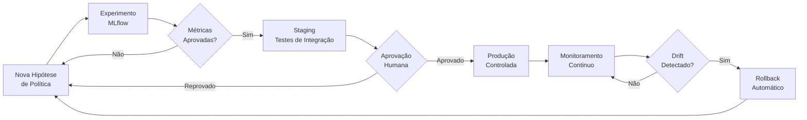

# Plano de Ciclo de Vida MLOps — OfferExp

**Projeto**: Datathon 7MLET  
**Grupo**: 77 — Geremias Francisco / Wagner Ulisses  
**Data**: Junho 2025

---

## Visão Geral

Este documento descreve como novas políticas de decisão são testadas, aprovadas e promovidas para produção na plataforma OfferExp, seguindo práticas de MLOps com rastreabilidade, aprovação humana e rollback documentado.



---

## 1. Fase de Experimentação

### 1.1 Critérios para iniciar um experimento

Uma nova política pode ser proposta quando:
- O reward médio acumulado fica abaixo do baseline por 7 dias consecutivos.
- É detectado drift no perfil dos clientes (mudança >15% na distribuição de features).
- Nova hipótese algorítmica é identificada (ex.: LinUCB contextual).

### 1.2 Execução e rastreio

Cada experimento é registrado no MLflow com:
- `policy_name`, `policy_version`, `seed`
- Métricas: `avg_reward`, `final_regret`, `best_arm_pct`, `rounds`
- Step metrics: reward e regret por rodada
- Artefatos: estado final dos braços (`policy_state.pkl`), CSVs de avaliação, gráficos

### 1.3 Critérios de promoção (Staging)

| Métrica | Threshold mínimo |
|---------|-----------------|
| `avg_reward` | > Baseline Random + 5% |
| `final_regret` | < Baseline Random em 20% |
| `best_arm_pct` | > 25% (exploração mínima garantida) |
| Testes automatizados | 100% passando |

---

## 2. Fase Staging

### 2.1 Testes de integração

Antes da promoção para produção, a nova política é testada em ambiente staging com:
- Execução contra o **golden set** (`data/golden_set/evaluation_cases.jsonl`) — todos os 25 casos devem passar nos critérios `pass_criteria`.
- Teste de carga: 1.000 requisições simultâneas com latência P95 < 200ms.
- Verificação de logs auditáveis: todos os campos obrigatórios presentes.

### 2.2 Aprovação humana (Human-in-the-loop)

A promoção para produção requer aprovação explícita de um analista via checklist:

```
[ ] Métricas de avaliação offline aprovadas
[ ] Golden set 100% passando
[ ] Distribuições posteriores analisadas e sem anomalias
[ ] Comparação visual (gráficos reward e regret) revisada
[ ] Nenhum braço com seleção < 5% (guardrail de exploração mínima)
[ ] MLflow run_id documentado no PR de deploy
[ ] Rollback plan definido (versão anterior identificada)
```

---

## 3. Promoção para Produção

### 3.1 Deploy controlado (canary)

- **Fase 1 (5%)**: 5% do tráfego vai para a nova política. Monitorar por 24h.
- **Fase 2 (25%)**: Se reward médio ≥ threshold, expandir para 25%. Monitorar por 48h.
- **Fase 3 (100%)**: Promoção total após aprovação da segunda fase.

### 3.2 Versionamento

Cada versão de política tem:
- `policy_version`: string semântica (ex.: `thompson-v2`)
- MLflow `run_id`: rastreabilidade do experimento que gerou a política
- Tag no repositório git: `policy/thompson-v2`

---

## 4. Monitoramento Contínuo

### 4.1 Métricas monitoradas (Azure Monitor + Application Insights)

| Métrica | Frequência | Alerta |
|---------|-----------|--------|
| Reward médio (janela 1h) | Tempo real | < 8% dispara alerta |
| Regret acumulado diário | Diário | Crescimento > 20% em 7d |
| % seleções por braço | Horário | Qualquer braço < 3% por 4h |
| Latência P95 do `/decide` | Tempo real | > 200ms por 5min |
| Taxa de erro 5xx | Tempo real | > 0.5% por 1min |

### 4.2 Detecção de drift

Drift é detectado quando:
- **Reward drift**: reward médio de 7 dias cai > 15% vs. média dos 30 dias anteriores.
- **Feature drift**: distribuição de `idade`, `profissao` ou `escolaridade` diverge > 20% do baseline (teste KS p-value < 0.05).
- **Arm drift**: braço dominante muda por mais de 3 dias consecutivos sem mudança de política.

---

## 5. Rollback

### 5.1 Rollback automático

Acionado quando:
- Reward médio < 8% por mais de 2h consecutivas.
- Taxa de erro 5xx > 1% por mais de 1min.
- Latência P95 > 500ms por mais de 5min.

**Procedimento**: Azure Container Apps reverte automaticamente para a revisão anterior via `az containerapp revision deactivate`.

### 5.2 Rollback manual

Comando documentado para rollback manual em caso de emergência:

```bash
# Listar revisões disponíveis
az containerapp revision list --name offerexp-api --resource-group offerexp-rg

# Ativar revisão anterior
az containerapp revision activate \
  --name offerexp-api \
  --resource-group offerexp-rg \
  --revision <revision-name-anterior>
```

O MLflow run_id da versão em produção antes do rollback é documentado no incident report.

---

## 6. Registro de Decisões de Ciclo de Vida

Toda promoção, rollback ou mudança de política deve ser registrada com:
- Data e hora
- Responsável pela aprovação
- MLflow run_id da nova política
- Motivo da mudança
- Métricas antes e depois

Este registro é mantido em `docs/policy-changelog.md` (a ser criado a cada evento).
